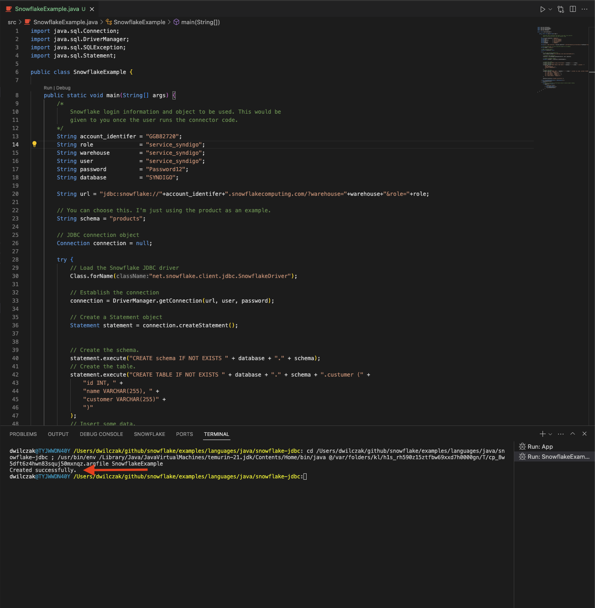

# Java-odbc-connector
This tutorial will show you how to create a connector to load data into snowflake from your java application using our jdbc library.

## Steps:
There is really only four steps.

### 1. Sql 
Get your customer to run this sql in there snowflake account and then have them tell you what they used as variables:
```sql
Begin; 
    -- create variables for user / password / role / warehouse / database (needs to be uppercase for objects)
    set role_name = 'service_syndigo';
    set user_name = 'service_syndigo';
    set user_password = '...';
    set warehouse_name = 'service_syndigo';
    set database_name = 'syndigo';

    -- change role to securityadmin for user / role steps
    use role securityadmin;

    -- create role for syndigo
    create role if not exists identifier($role_name);
    grant role identifier($role_name) to role SYSADMIN;

    -- create a user for syndigo
    create user if not exists identifier($user_name)
    password = $user_password
    default_role = $role_name
    default_warehouse = $warehouse_name;

    grant role identifier($role_name) to user identifier($user_name);

    -- change role to sysadmin for warehouse / database steps
    use role sysadmin;

    -- create a warehouse for syndigo
    create warehouse if not exists identifier($warehouse_name)
    warehouse_size = xsmall
    warehouse_type = standard
    auto_suspend = 60
    auto_resume = true
    initially_suspended = true;

    -- create database for syndigo
    create database if not exists identifier($database_name);

    -- grant syndigo role access to warehouse
    grant USAGE
    on warehouse identifier($warehouse_name)
    to role identifier($role_name);

    -- grant syndigo access to database
    use role ACCOUNTADMIN;
    grant CREATE SCHEMA, MONITOR, USAGE
    on database identifier($database_name)
    to role identifier($role_name);
commit;
```

### 2. JDBC
Install the jdbc library (.jar) file into your java project / application. This will depend on the application and IDE. I have included the .jar I used in the repo. A list can be found here. I used the most recent (closest to current date).

https://repo1.maven.org/maven2/net/snowflake/snowflake-jdbc/

### 3. Application:
This is an example where the user would give you the string values for connection, role, warehouse and database. It creates a schema called products and a table called customers in products schema. I have also inserted some sample data. 

```java
import java.sql.Connection;
import java.sql.DriverManager;
import java.sql.SQLException;
import java.sql.Statement;

public class SnowflakeExample {

    public static void main(String[] args) {
        /* 
            Snowflake login information and object to be used. This would be
            given to you once the user runs the connector code.
        */ 
        String account_identifer = "GGB82720";
        String role              = "service_syndigo";
        String warehouse         = "service_syndigo";
        String user              = "service_syndigo";
        String password          = "...";
        String database          = "SYNDIGO";

        String url = "jdbc:snowflake://"+account_identifer+".snowflakecomputing.com/?warehouse="+warehouse+"&role="+role;
       
        // You can choose this. I'm just using the product as an example.
        String schema = "products";

        // JDBC connection object
        Connection connection = null;

        try {
            // Load the Snowflake JDBC driver
            Class.forName("net.snowflake.client.jdbc.SnowflakeDriver");

            // Establish the connection
            connection = DriverManager.getConnection(url, user, password);

            // Create a Statement object
            Statement statement = connection.createStatement();
            

            // Create the schema.
            statement.execute("CREATE schema IF NOT EXISTS " + database + "." + schema);
            // Create the table.
            statement.execute("CREATE TABLE IF NOT EXISTS " + database + "." + schema + ".custumer (" +
                "id INT, " +
                "name VARCHAR(255), " +
                "customer VARCHAR(255)" +
                ")"
            );
            // Insert some data.
            statement.execute("INSERT INTO " + database + "." + schema + ".custumer (id, name, customer) VALUES " +
                "(1, 'John Doe', 'Company A'), " +
                "(2, 'Jane Smith', 'Company B'), " +
                "(3, 'Bob Johnson', 'Company C'), " +
                "(4, 'Alice Brown', 'Company A'), " +
                "(5, 'Charlie White', 'Company B')"
            );

            System.out.println("Created successfully.");

        } catch (ClassNotFoundException | SQLException e) {
            e.printStackTrace();
        } finally {
            // Close the connection in the finally block to ensure proper cleanup
            if (connection != null) {
                try {
                    connection.close();
                } catch (SQLException e) {
                    e.printStackTrace();
                }
            }
        }
    }
}
```

### 4. Result:
Here is the result of me running it on my local machine:


The result on snowflake:


